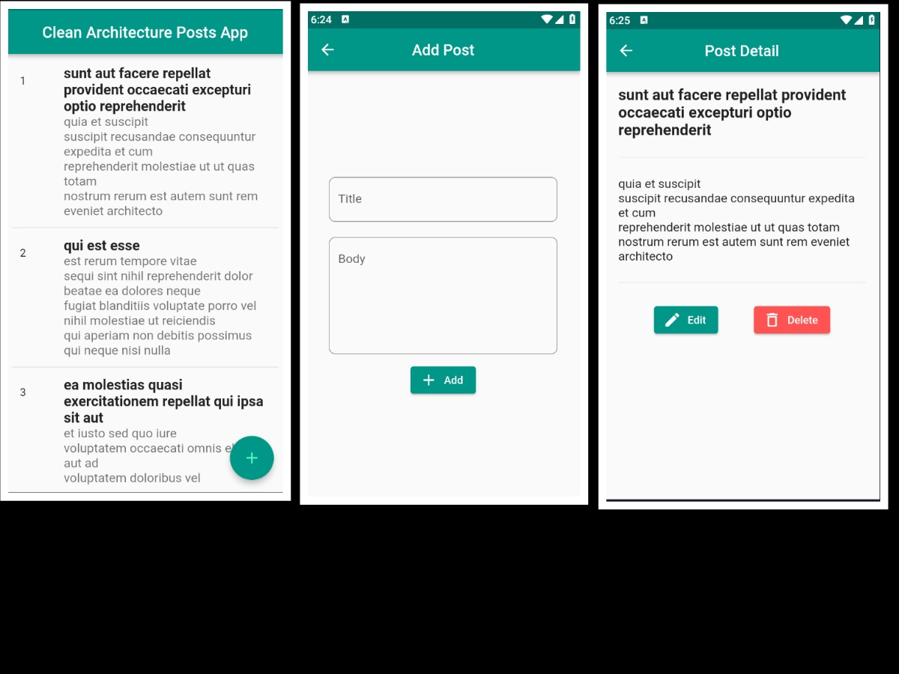

# Clean Architecture App Using JsonPaceHolder Apis

# Descreption
   Simple App to practice on Clean Architecture for Apps

## Integrations

- flutter_bloc
- dartz: ^0.10.1
- equatable: ^2.0.5
- internet_connection_checker: ^1.0.0+1
- http: ^1.1.0
- shared_preferences: ^2.2.1

# Project Photos
- App ScreenShots

